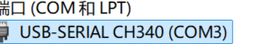
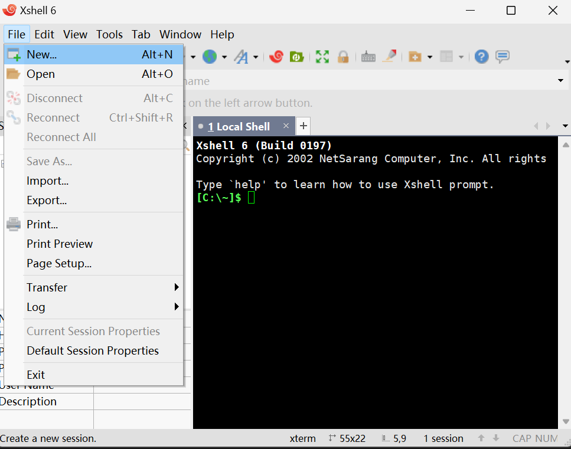
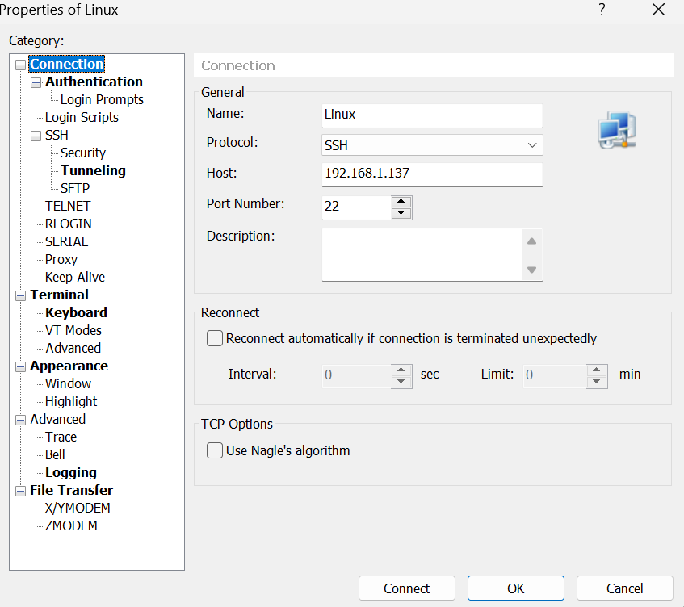
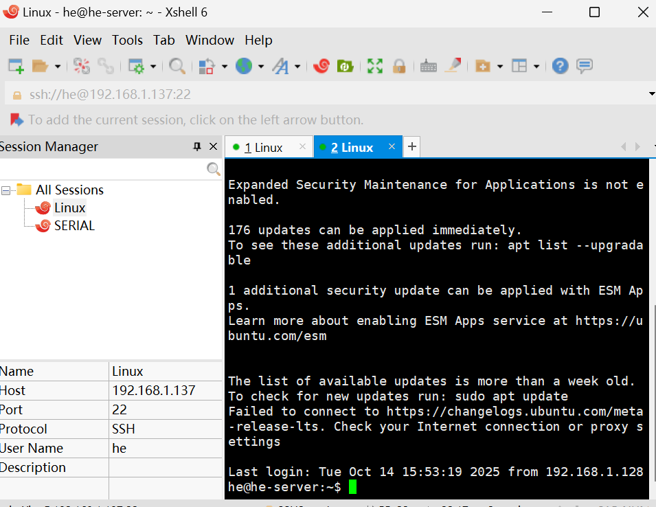
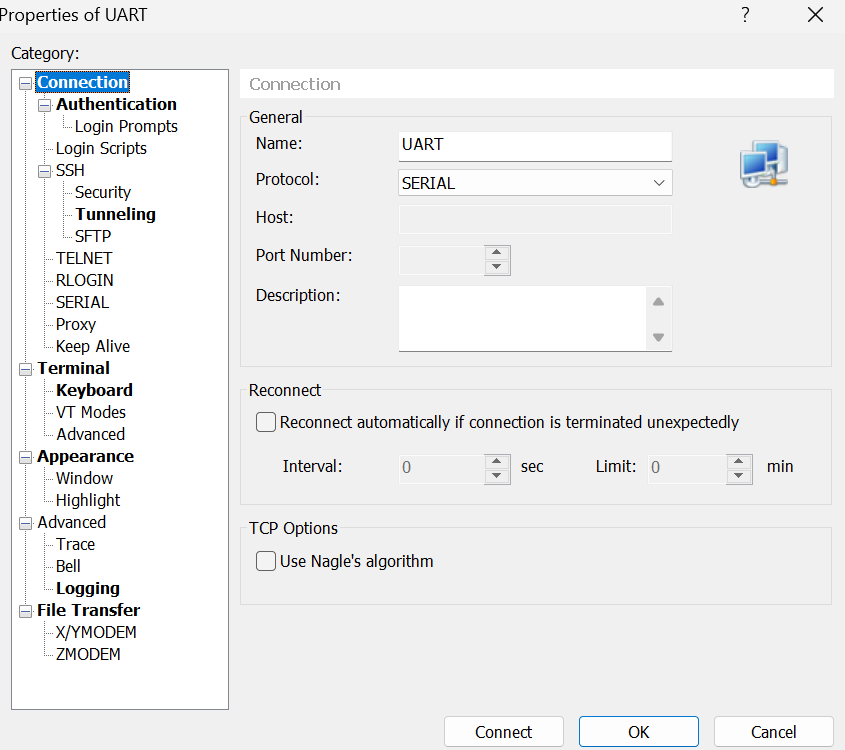
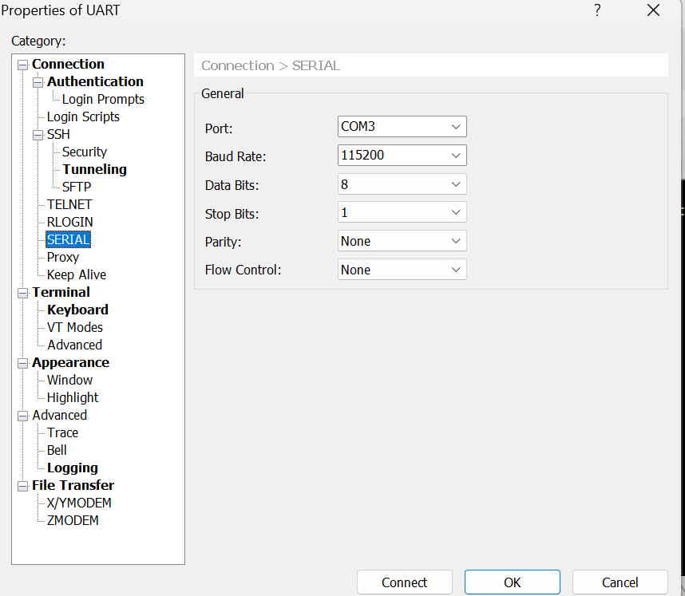

Requisitos del entorno de desarrollo para ESP32

1️ Controlador USB ↔ UART (TTL) para ordenador
→ El driver que permite la comunicación entre el ordenador y la placa ESP32 a través del puerto USB (por ejemplo, CH340 o CP2102).
    

2️ Entorno Linux, incluyendo sistema de archivos y herramientas de compilación/desarrollo
→ Un entorno Linux con las utilidades necesarias para compilar, programar y gestionar proyectos (make, gcc, git, etc.).
    Ubuntu 24.04.2 LTS (GNU/Linux 6.14.0-33-generic x86_64)

3️ Editor en Windows: Visual Studio Code (VS Code)
→ Editor de código moderno y multiplataforma, recomendado para editar y compilar programas del ESP32.

4️ Aplicación de terminal para interactuar con Linux y gestionar el puerto serie
→ Actualmente se usa Xshell, aunque también se pueden emplear otras alternativas como MobaXterm, PuTTY o minicom.

Primero, entra en Xshell y selecciona “Nuevo”.

Después, configura el Nombre (NAME), el Protocolo (PROTOCOL) y el Host (HOST).

Por último, haz clic en “OK” y luego en “Connect”.

En segundo lugar, utiliza el protocolo serie para controlar la entrada y salida del dispositivo ESP32.
    
    

5️ Una placa de desarrollo ESP32
→ La placa principal utilizada para la programación, pruebas y desarrollo de proyectos.

6 un osciloscopio
